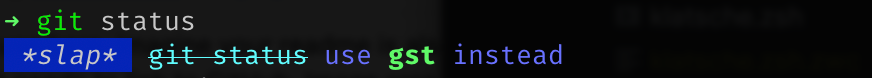

# klatsche

Gives you a ⚡️ blazingly-fast ⚡️ slap on the wrist if you forget to use your terminal aliases.



## Installation

### Prerequisites

- `rust` installed
- `zsh` installed and configured
- optional: `zimfw` setup for use with `zmodule`

### Install from crates.io

```bash
cargo install klatsche
```

### Build from source

Clone the repository and run:

```bash
cargo build --release
```

### Installing ZSH plugin

#### Install using `zmodule`

Add the following to your `.zimfw` file:

```bash
zmodule /Path/to/klatsche --source klatsche.zsh
```

When building from source, set the `KLATSCHE_HOME` env variable in your `.zshrc` file:

```bash
KLATSCHE_HOME=/Path/to/klatsche
```

and then add the following to your `.zimfw` file:

```bash
zmodule /Path/to/klatsche --source klatsche_from_source.zsh
```

Run `zimfw install` and restart terminal session.

Restart terminal session.

## Usage

Type any long form of an alias, you get a _slap_ in the terminal 🎉
